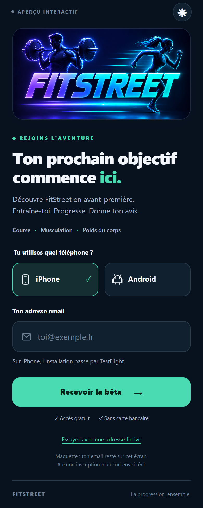
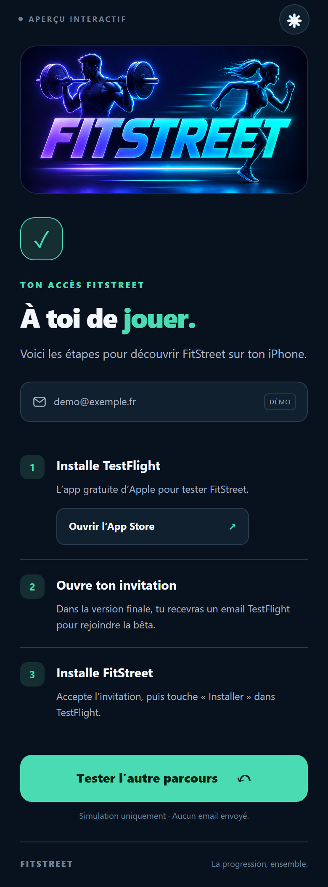
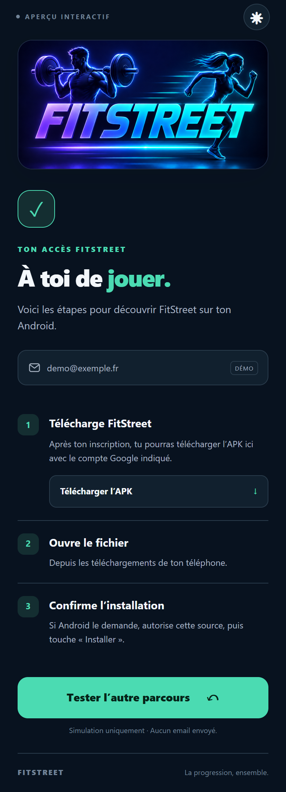
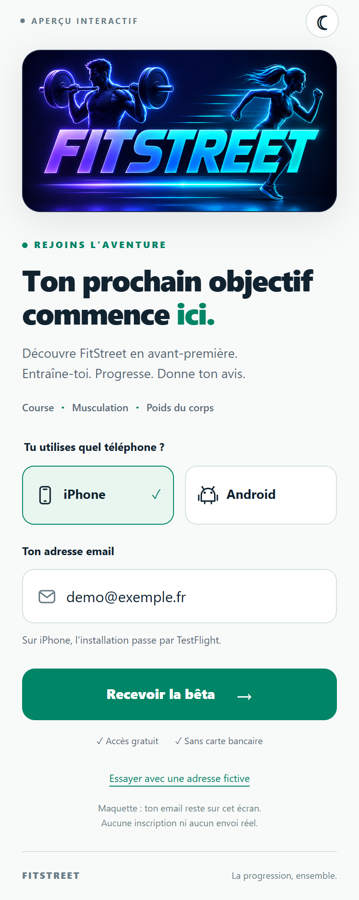

# FitStreet · Aperçu de l’accès bêta

## [👉 Ouvrir la maquette interactive sur iPhone](https://kader-ai.github.io/fitstreet-beta-preview/)

Choisis **iPhone** ou **Android**, puis touche **Essayer avec une adresse fictive**.
Le bouton soleil permet aussi de voir le thème clair.

**Il s’agit d’une démonstration.** Aucune adresse email n’est transmise ou enregistrée.
Les invitations TestFlight et le téléchargement de l’APK sont simulés. Le bouton
App Store ouvre la véritable fiche de TestFlight.

Le rendu est une maquette personnalisée du parcours envisagé. Ce n’est pas une
capture de Notion : l’habillage exact devra être adapté si Notion gratuit est retenu.
Le parcours Android prévu garde l’email obligatoire pour le suivi dans un Sheet
privé, puis affiche le téléchargement après attribution de l’accès Drive, sans
attendre un email. Le branchement Google et App Store Connect reste à activer.

### Accueil

[Ouvrir l’image en grand](./apercu-iphone.png)

### Après le choix iPhone

### Après le choix Android

### Thème clair

Contrôles automatisés : saisie invalide, parcours iOS/Android, changement de thème,
retour au formulaire et largeurs 320, 390, 430 et 1280 px. Aucun essai physique
sur iPhone n’est revendiqué. Aucun code ni aucune donnée de l’application ne figure ici.
